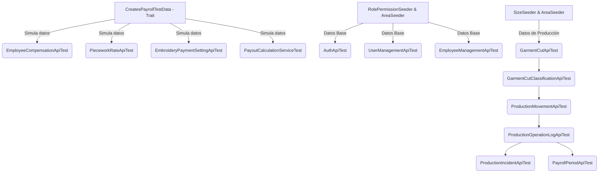

# Documentación de Pruebas Unitarias e Integración (uyn-backend)

Esta documentación proporciona un desglose completo de la suite de pruebas unitarias y de integración implementada para el backend del sistema de gestión (**uyn-backend**). 

Toda la suite de pruebas fue ejecutada de forma local con éxito. A continuación se presentan los resultados generales de la ejecución y el desglose detallado de cada módulo evaluado.

---

## 📊 Resumen Ejecutivo del Ejecutor de Pruebas

> [!NOTE]
> La ejecución se realizó sobre un entorno de base de datos controlado en memoria utilizando el framework PHPUnit integrado con Laravel.

* **Total de Pruebas (Tests):** 178
* **Total de Aserciones (Assertions):** 1103
* **Resultado Global:** `OK (178 tests, 1103 assertions)`
* **Estado de Aceptación:** **100% Aprobado (Passed)**
* **Tiempo de Ejecución:** ~22.1 segundos
* **Versión de PHP:** 8.5.4
* **Versión de PHPUnit:** 12.5.30

---

## 🏗️ Estructura del Entorno y Flujo de Datos en Pruebas

Las pruebas se dividen técnicamente en pruebas unitarias (`tests/Unit`) y de integración/características (`tests/Feature`). Para lograr el aislamiento óptimo, cada clase de prueba hace uso de las siguientes herramientas de Laravel:

1. **`RefreshDatabase`:** Reinicia la base de datos y ejecuta las migraciones antes de cada método de prueba individual para asegurar que los datos no se traslapen.
2. **Seeders Base:** En los métodos `setUp()` de las pruebas, se ejecutan seeders primarios para poblar catálogos esenciales:
   * [RolePermissionSeeder](file:///home/jeduardocs/Proyectos/U-N-Sistema-de-Gesti-n-de-Almacenes/uyn-backend/database/seeders/RolePermissionSeeder.php) (Roles de Administrador, Supervisores y Encargados).
   * [AreaSeeder](file:///home/jeduardocs/Proyectos/U-N-Sistema-de-Gesti-n-de-Almacenes/uyn-backend/database/seeders/AreaSeeder.php) (Áreas físicas: Corte, Diseño, Bordado, Maquila, Preparación, Terminado).
   * [SizeSeeder](file:///home/jeduardocs/Proyectos/U-N-Sistema-de-Gesti-n-de-Almacenes/uyn-backend/database/seeders/SizeSeeder.php) (Tallas numéricas y alfabéticas estándar).
3. **Trait Auxiliar `CreatesPayrollTestData`:** Trait personalizado ([CreatesPayrollTestData.php](file:///home/jeduardocs/Proyectos/U-N-Sistema-de-Gesti-n-de-Almacenes/uyn-backend/tests/Concerns/CreatesPayrollTestData.php)) que provee métodos simplificados para crear registros de negocio de nómina como:
   * Empleados activos y áreas.
   * Compensaciones fijas semanales o tarifas por destajo.
   * Configuraciones de precios y fórmulas de bordado.
   * Logs de operaciones físicas terminadas.

---

## 📂 Desglose Detallado por Módulos y Pruebas

A continuación se enlistan los archivos de prueba ubicados en la carpeta `tests/` del backend, los datos de entrada simulados (inputs), las aserciones lógicas que validan el comportamiento y su resultado final.

---

### 1. Control de Acceso a Catálogos (`AccessCatalogApiTest.php`)
* **Ubicación:** `tests/Feature/AccessCatalogApiTest.php`
* **Propósito:** Validar que solo usuarios con permisos adecuados puedan listar roles y permisos.
* **Casos de Prueba (3):**
  * `test_administrator_can_list_roles`: Verifica que un administrador liste roles de usuario.
  * `test_administrator_can_list_permissions`: Valida que el administrador vea la lista de permisos técnicos.
  * `test_user_without_roles_permission_cannot_list_roles`: Restringe la vista de roles a usuarios regulares sin permisos.
* **Datos Utilizados y Mocks/Fakes:**
  * **Semilla `RolePermissionSeeder`**: Popula los roles de seguridad estándar y sus respectivos permisos en la base de datos temporal.
  * **`User::factory()` (Factory)**: Genera registros de usuarios simulados en la base de datos de pruebas. Permite crear un administrador (`admin.catalogos` con estado activo) para evaluar respuestas exitosas (200 OK), y un usuario regular activo sin roles asignados para comprobar la restricción de accesos (403 Forbidden).
  * **Laravel Sanctum (`Sanctum::actingAs`) (Fake)**: Simula de forma virtual la autenticación del usuario y la cabecera Bearer, evitando la necesidad de realizar peticiones HTTP de login reales.
* **Aserciones Principales:**
  * `assertOk()` (Estatus 200).
  * `assertJsonFragment()` validando que la respuesta incluya los roles `'Administrador'`, `'Encargado de producción'`, y permisos como `'users.view'` y `'cuts.create'`.
  * `assertForbidden()` (Estatus 403) para peticiones no autorizadas.

---

### 2. Autenticación y Sesiones (`AuthApiTest.php`)
* **Ubicación:** `tests/Feature/AuthApiTest.php`
* **Propósito:** Probar el flujo de login, logout, bloqueo de usuarios inactivos y recuperación de perfiles propios de usuario.
* **Casos de Prueba (5):**
  * `test_active_user_can_login_with_username`
  * `test_login_fails_with_invalid_credentials`
  * `test_inactive_user_cannot_login`
  * `test_authenticated_user_can_view_own_profile`
  * `test_authenticated_user_can_logout_and_revoke_current_token`
* **Datos Utilizados y Mocks/Fakes:**
  * **`User::factory()` (Factory)**: Genera registros de prueba con la contraseña cifrada mediante `Hash::make('Segura#2026!')` y permite simular tanto estados activos como inactivos en la base de datos para probar la denegación de login a cuentas bloqueadas.
  * **Generador de Tokens de Sanctum (`createToken()`) (Fake)**: Simula la emisión de tokens `Bearer` y su inserción en la tabla de base de datos de tokens personales (`personal_access_tokens`) para probar el perfil de usuario actual `/api/v1/auth/me` y el flujo de cierre de sesión (`logout`).
* **Aserciones Principales:**
  * `assertOk()` y validación del mensaje de éxito `"Inicio de sesión correcto."`
  * `assertJsonStructure()` para validar que el token de tipo `Bearer` y los campos de la estructura de perfil (`id`, `name`, `username`, `roles`, `permissions`) se retornen en el JSON.
  * `assertDatabaseCount('personal_access_tokens', 1)` y posterior `0` después de desloguear.
  * `assertUnauthorized()` (401) y `assertForbidden()` (403) con mensajes descriptivos.

---

### 3. Ajustes de Pago de Bordado (`EmbroideryPaymentSettingApiTest.php`)
* **Ubicación:** `tests/Feature/EmbroideryPaymentSettingApiTest.php`
* **Propósito:** Administrar los factores de la fórmula matemática para pago de operarios del área de bordado.
* **Casos de Prueba (5):**
  * `test_administrator_can_create_embroidery_payment_setting`
  * `test_embroidery_setting_rejects_default_payment_lower_than_minimum`
  * `test_embroidery_setting_cannot_be_created_for_normal_operation`
  * `test_active_embroidery_settings_cannot_overlap`
  * `test_pricing_values_cannot_be_edited_on_existing_setting`
* **Datos Utilizados y Mocks/Fakes:**
  * **`User::factory()` (Factory)**: Autentica al administrador encargado de crear la configuración.
  * **`OperationProcess::factory()` (Factory)**: Genera procesos operativos en la base de datos marcados con los tipos de cálculo requeridos (`embroidery_formula` o `per_piece`), permitiendo asegurar que las fórmulas de bordado solo se puedan asociar a operaciones válidas.
  * **`EmbroideryPaymentSetting::factory()` (Factory)**: Crea configuraciones persistidas en la base de datos para validar restricciones de solapamiento de fechas y la inmutabilidad de los precios en registros existentes.
* **Aserciones Principales:**
  * `assertCreated()` (201) y verificación de los campos exactos del JSON.
  * `assertUnprocessable()` (422) con `assertJsonValidationErrors()` para rechazar configuraciones inválidas o solapamiento de fechas.

---

### 4. Compensación de Empleados (`EmployeeCompensationApiTest.php`)
* **Ubicación:** `tests/Feature/EmployeeCompensationApiTest.php`
* **Propósito:** Validar la definición y vigencia de las compensaciones (a destajo vs sueldos fijos) de los trabajadores.
* **Casos de Prueba (5):**
  * `test_administrator_can_create_piecework_compensation`
  * `test_fixed_compensation_requires_frequency_and_fixed_amount`
  * `test_active_compensations_cannot_overlap_for_same_employee`
  * `test_administrator_can_deactivate_compensation`
  * `test_user_without_payroll_permission_cannot_create_compensation`
* **Datos Utilizados y Mocks/Fakes:**
  * **`User::factory()` (Factory)**: Simula tanto al administrador (con permisos de nómina) como a un usuario básico para testear las restricciones de acceso.
  * **`Employee::factory()` (Factory)**: Genera al trabajador en la base de datos con un estado activo asociado a un área física para poder enlazarle las compensaciones.
  * **`EmployeeCompensation::factory()` (Factory)**: Simula e inserta compensaciones existentes a fin de verificar el bloqueo al intentar traslapar fechas de compensaciones para el mismo empleado.
* **Aserciones Principales:**
  * `assertDatabaseHas('employee_compensations', [...])` comprobando la inserción exacta.
  * `assertJsonValidationErrors([...])` en caso de faltar parámetros obligatorios para sueldo fijo.
  * `assertForbidden()` si el actor no tiene el permiso de administración de nóminas.

---

### 5. Catálogo de Empleados (`EmployeeManagementApiTest.php`)
* **Ubicación:** `tests/Feature/EmployeeManagementApiTest.php`
* **Propósito:** Gestionar y auditar la creación, actualización, asignación de áreas y bajas de los trabajadores.
* **Casos de Prueba (10):**
  * `test_administrator_can_list_production_areas`
  * `test_administrator_can_create_internal_employee`
  * `test_administrator_can_create_external_worker`
  * `test_administrator_can_filter_workers_by_area_type_and_status`
  * `test_administrator_can_search_workers_by_name_or_phone`
  * `test_administrator_can_update_worker_and_register_audit_log`
  * `test_administrator_can_deactivate_and_activate_worker`
  * `test_user_with_consultation_role_can_view_workers_but_cannot_create_them`
  * `test_user_without_employee_permissions_cannot_access_worker_catalog`
  * `test_worker_creation_requires_valid_data`
* **Datos Utilizados y Mocks/Fakes:**
  * **`User::factory()` (Factory)**: Genera administradores con permisos totales de catálogo y perfiles de consulta sin permisos de escritura para asegurar las reglas de autorización del endpoint.
  * **`Employee::factory()` (Factory)**: Genera registros de empleados de prueba con diversas combinaciones de nombres, estados y tipos de trabajador (interno o maquilero externo) para comprobar los filtros de búsqueda y la auditoría automática.
* **Aserciones Principales:**
  * Comprobación en base de datos de registros en `employees` y registros en `operation_logs` de auditoría global.
  * Mapeo de labels lógicos (por ejemplo, `'Empleado interno'` o `'Maquilero externo'`).

---

### 6. Órdenes de Corte (`GarmentCutApiTest.php`)
* **Ubicación:** `tests/Feature/GarmentCutApiTest.php`
* **Propósito:** Validar el registro de cortes asociados a órdenes de producción y la distribución de piezas por tallas.
* **Casos de Prueba (11):**
  * `test_administrator_can_create_cut_with_uniform_distribution`
  * `test_administrator_can_create_cut_with_non_uniform_distribution`
  * `test_administrator_can_view_cut_detail_with_sizes`
  * `test_administrator_can_filter_and_search_cuts`
  * `test_administrator_can_update_registered_cut_and_recalculate_totals`
  * `test_non_registered_cut_cannot_be_updated`
  * `test_cannot_create_cut_in_completed_or_cancelled_order`
  * `test_cut_creation_rejects_inactive_model_or_inactive_size`
  * `test_cut_creation_rejects_server_controlled_fields`
  * `test_consultation_user_can_view_cuts_but_cannot_create_them`
  * `test_user_without_cut_permissions_cannot_access_cuts`
* **Datos Utilizados y Mocks/Fakes:**
  * **`User::factory()` (Factory)**: Crea administradores y usuarios de consulta para validar los niveles de acceso.
  * **`ProductionOrder::factory()` (Factory)**: Genera órdenes de producción en la base de datos en diferentes estados (activa, completada, cancelada) para simular que no se puedan crear cortes en órdenes bloqueadas.
  * **`GarmentModel::factory()` (Factory)**: Crea registros de modelos de prendas (activos e inactivos) para verificar la validación de vigencia del modelo del corte.
  * **`GarmentCut::factory()` (Factory)**: Genera registros de cortes existentes para evaluar las búsquedas, filtros y actualizaciones del reparto de tallas.
* **Aserciones Principales:**
  * `assertCreated()`, comprobando cálculo de sumatorias lógicas en `total_pieces` y la bandera `is_uniform_distribution`.
  * Restricciones de cambios en base a estados bloqueantes de la orden (completada, cancelada).

---

### 7. Clasificación de Piezas del Corte (`GarmentCutClassificationApiTest.php`)
* **Ubicación:** `tests/Feature/GarmentCutClassificationApiTest.php`
* **Propósito:** Validar la definición técnica de los componentes del corte (piezas principales, complementos y piezas especiales) para iniciar su flujo de producción.
* **Casos de Prueba (13):**
  * Lista y configura flujos de trabajo de complementos.
  * Valida que el corte deba estar en el estado `'registered'` y en el área de `'Corte'` o `'Diseño'` para ser clasificado.
  * Impide modificaciones a la clasificación si las piezas correspondientes ya iniciaron operaciones o movimientos físicos.
* **Datos Utilizados y Mocks/Fakes:**
  * **`User::factory()` (Factory)**: Genera los diferentes usuarios autenticados (administradores, diseñadores o encargados de taller).
  * **`ProductionOrder::factory()` y `GarmentModel::factory()` (Factories)**: Instancian las entidades necesarias para poder registrar el corte.
  * **`GarmentCut::factory()` (Factory)**: Genera cortes en estado registrado o en progreso para validar que la clasificación técnica (desglose de piezas principales y complementos) solo sea permitida cuando el lote está en fases iniciales.
* **Aserciones Principales:**
  * Aserciones de estados y validación de reglas de negocio (`assertUnprocessable()`, `assertForbidden()`).

---

### 8. Catálogo de Modelos (`GarmentModelApiTest.php`)
* **Ubicación:** `tests/Feature/GarmentModelApiTest.php`
* **Propósito:** Controlar altas, bajas y cambios de los diseños/modelos del catálogo, incluyendo imágenes físicas.
* **Casos de Prueba (10):**
  * `test_administrator_can_create_garment_model_without_image`
  * `test_administrator_can_create_garment_model_with_image`
  * ... (filtros, búsquedas, actualizaciones, reemplazo físico de imágenes).
* **Datos Utilizados y Mocks/Fakes:**
  * **`User::factory()` (Factory)**: Crea al administrador autenticado para gestionar el catálogo de modelos.
  * **`GarmentModel::factory()` (Factory)**: Genera registros previos de modelos de prendas para comprobar filtros, búsquedas por código y control de unicidad.
  * **`Storage::fake('public')` (Fake)**: Simula un disco de almacenamiento en memoria para interceptar y prevenir la escritura física de archivos en el disco del servidor.
  * **`UploadedFile::fake()->image('modelo_prenda.png')` (Fake)**: Genera un archivo virtual de imagen para simular la subida HTTP del archivo físico y verificar que la validación de formato y almacenamiento del archivo funcione correctamente.
* **Aserciones Principales:**
  * `Storage::disk('public')->assertExists(...)` y `assertMissing(...)` al ser reemplazadas.
  * Unicidad del código de modelo e inserciones en logs de auditoría.

---

### 9. Cálculo Matemático de Nómina (`PayoutCalculationServiceTest.php`)
* **Ubicación:** `tests/Feature/PayoutCalculationServiceTest.php`
* **Propósito:** Verificar el núcleo matemático de procesamiento de nómina por pieza/destajo y bordado.
* **Casos de Prueba (6):**
  * `test_calculates_embroidery_payment_above_minimum`: Verifica que si la fórmula arroja un monto superior al mínimo, se aplique el cálculo directo de puntadas y aplicaciones.
  * `test_uses_default_payment_when_embroidery_formula_is_below_minimum`: Si el cálculo es inferior, fuerza el uso del pago mínimo por pieza.
  * `test_calculates_standard_per_piece_payment`: Valida multiplicación simple de piezas terminadas por tarifa.
  * `test_fixed_compensation_does_not_generate_operation_payout`: Sueldo fijo no recibe destajo.
  * `test_piecework_operation_without_rate_remains_pending`: Logs sin tarifas vigentes entran en estado pendiente de configuración.
  * `test_embroidery_piecework_requires_stitches_when_setting_exists`: Lanza error si no se envían las puntadas físicas en el log de bordado.
* **Datos Utilizados y Mocks/Fakes:**
  * **`User::factory()` (Factory)**: Genera al actor de la operación.
  * **`Employee::factory()` y `Area::factory()` (Factories)**: Simulan al trabajador y el taller al que pertenece.
  * **`OperationProcess::factory()` (Factory)**: Crea procesos configurados con el tipo de cálculo de pago específico.
  * **`ProductionOperationLog::factory()` (Factory)**: Simula el registro del reporte de avance de producción física del lote.
  * **`EmployeeCompensation::factory()` (Factory)**: Establece el tipo de compensación vigente del empleado.
  * **`PieceworkRate::factory()` y `EmbroideryPaymentSetting::factory()` (Factories)**: Populan los precios y configuraciones de fórmulas para realizar el cálculo matemático.
  * **`Carbon::parse('2026-07-07 10:00:00')` (Fake/Mock de Carbon)**: Fija una fecha y hora temporal controlada en memoria para validar la aplicación correcta de vigencias sin depender de la hora actual del servidor.
* **Aserciones Principales:**
  * `assertSame('126.00', $result['payout_amount'])` (Bordado arriba del mínimo).
  * `assertSame('75.00', $result['payout_amount'])` (Aplicación de tarifa mínima).
  * `assertSame('360.00', $result['payout_amount'])` (Destajo de 80 pzas x $4.50).
  * `assertSame('pending_configuration', $result['payout_snapshot.payment_status'])`.

---

### 10. Exportaciones de Nómina (`PayrollExportApiTest.php`)
* **Ubicación:** `tests/Feature/PayrollExportApiTest.php`
* **Propósito:** Garantizar que los administradores exporten de forma limpia a CSV los resúmenes financieros de periodos de nómina.
* **Casos de Prueba (3):**
  * `test_can_export_payroll_period_report_as_csv`
  * `test_can_export_employee_payroll_report_as_csv`
  * `test_user_without_reports_export_permission_cannot_export_payroll_reports`
* **Datos Utilizados y Mocks/Fakes:**
  * **`User::factory()` (Factory)**: Crea usuarios administradores autorizados y usuarios básicos sin permisos para validar la restricción del endpoint.
  * **`Employee::factory()` (Factory)**: Simula al trabajador con datos básicos asignados.
  * **`PayrollPeriod::factory()` (Factory)**: Genera un periodo de nómina con estatus cerrado para el test de exportación.
  * **`PayrollEmployeeSummary::factory()` y `PayrollDetail::factory()` (Factories)**: Generan los resúmenes de nómina y los desgloses individuales para garantizar que el archivo CSV resultante contenga exactamente la información de pago.
* **Aserciones Principales:**
  * `assertOk()`
  * `assertHeader('Content-Type', 'text/csv')` y validación del contenido estructurado de las líneas exportadas.

---

### 11. Periodos de Nómina (`PayrollPeriodApiTest.php`)
* **Ubicación:** `tests/Feature/PayrollPeriodApiTest.php`
* **Propósito:** Controlar la apertura, cálculo y cierre contable de los periodos de nómina de los trabajadores.
* **Casos de Prueba (9):**
  * Creación y solapamiento de periodos.
  * Inclusión automática de registros de operaciones completadas en el lapso temporal del periodo.
  * Prorrateo exacto por días del salario fijo del trabajador.
  * Generación de nómina mixta (empleados que combinan días fijos y destajos).
  * Inhabilitación de cobros duplicados en periodos con frecuencias incompatibles.
  * Cierre y bloqueo del periodo para edición tras el pago.
* **Datos Utilizados y Mocks/Fakes:**
  * **`User::factory()` (Factory)**: Genera usuarios con roles contables o administrativos para validar la auditoría de apertura y cierre del periodo.
  * **`Employee::factory()` (Factory)**: Genera trabajadores con distintos tipos de compensaciones vigentes.
  * **`PayrollPeriod::factory()` (Factory)**: Simula periodos contables abiertos o pagados para comprobar el bloqueo de solapamiento de fechas y la inmutabilidad de periodos ya cerrados.
  * **`ProductionOperationLog::factory()` (Factory)**: Simula el reporte de piezas terminadas por destajo dentro de la ventana de fechas de la nómina para verificar la correcta agregación en los resúmenes financieros.
* **Aserciones Principales:**
  * Verificación de sumatorias, prorrateos y aserciones de actualización de estados de los resúmenes a `'paid'`.

---

### 12. Reportes de Nómina (`PayrollReportApiTest.php`)
* **Ubicación:** `tests/Feature/PayrollReportApiTest.php`
* **Propósito:** Verificar endpoints de visualización y filtrado de acumulados de nómina.
* **Casos de Prueba (4):**
  * Retorno de totales acumulados y detalles del periodo.
  * Filtros por tipo de pago (fijo o destajo) y periodos específicos.
* **Datos Utilizados y Mocks/Fakes:**
  * **`User::factory()` (Factory)**: Genera administradores autenticados para consultar los reportes.
  * **`PayrollPeriod::factory()` (Factory)**: Genera periodos contables específicos para filtrar.
  * **`PayrollEmployeeSummary::factory()` y `PayrollDetail::factory()` (Factories)**: Crean los resúmenes y partidas individuales de nómina en la base de datos para comprobar que los acumulados numéricos en el reporte final coincidan exactamente.
* **Aserciones Principales:**
  * `assertJsonPath(...)` comprobando coherencia matemática de la suma de nómina reportada.

---

### 13. Tarifas por Destajo (`PieceworkRateApiTest.php`)
* **Ubicación:** `tests/Feature/PieceworkRateApiTest.php`
* **Propósito:** Validar la vigencia y asignación de precios unitarios por operación.
* **Casos de Prueba (4):**
  * Asignación de tarifas en operaciones normales.
  * Bloqueo de asignación si el empleado no tiene una compensación de destajo activa.
  * Bloqueo si se intenta registrar tarifa por pieza directa en operaciones marcadas bajo fórmula de bordado.
  * Prevención de traslapes en vigencias de tarifas para un mismo trabajador y operación.
* **Datos Utilizados y Mocks/Fakes:**
  * **`User::factory()` (Factory)**: Genera al administrador autenticado que registra las tarifas.
  * **`Employee::factory()` (Factory)**: Simula al empleado que recibirá la tarifa.
  * **`OperationProcess::factory()` (Factory)**: Genera la operación para validar restricciones (por ejemplo, rechazar tarifas por pieza directa en operaciones asociadas a fórmulas de bordado).
  * **`EmployeeCompensation::factory()` (Factory)**: Genera compensaciones previas para validar que solo se puedan registrar tarifas de destajo a operarios con compensación activa de tipo destajo.
  * **`PieceworkRate::factory()` (Factory)**: Simula tarifas vigentes en base de datos para testear la validación de solapamiento de fechas.
* **Aserciones Principales:**
  * `assertUnprocessable()` (422) con mensajes informativos de validación de negocio.

---

### 14. Exportaciones de Producción (`ProductionExportApiTest.php`)
* **Ubicación:** `tests/Feature/ProductionExportApiTest.php`
* **Propósito:** Validar la exportación tabular (CSV) de cortes registrados, estados del proceso físico y el historial de movimientos de lotes.
* **Casos de Prueba (4):**
  * Descargas correspondientes a cortes, procesos e historial de movimientos.
* **Datos Utilizados y Mocks/Fakes:**
  * **`User::factory()` (Factory)**: Simula usuarios administradores (con permiso de exportación) y usuarios comunes para verificar los bloqueos de seguridad del endpoint.
  * **`GarmentCut::factory()` y `ProductionMovement::factory()` (Factories)**: Crean el lote de corte y sus movimientos asociados en la base de datos para certificar que el archivo CSV resultante contenga exactamente la información de producción e historial de traslados.
* **Aserciones Principales:**
  * `assertHeader('Content-Disposition', 'attachment; filename=...')` y restricciones para usuarios comunes sin permisos de exportación.

---

### 15. Incidencias de Producción y Mermas (`ProductionIncidentApiTest.php`)
* **Ubicación:** `tests/Feature/ProductionIncidentApiTest.php`
* **Propósito:** Módulo crítico para la gestión de pérdidas de piezas físicas, retrabajos lógicos, bloqueos temporales por calidad y penalizaciones.
* **Casos de Prueba (25):**
  * Creación de incidencias de calidad (`quality`) bloqueando el movimiento del lote.
  * Reporte de incidencias de retraso (`delay`) que marcan los lotes en estatus demorado.
  * Resolución de incidencias y reactivación del flujo físico de la orden.
  * Control de cantidades: la merma declarada no puede superar la cantidad de prendas del movimiento.
  * Validación de que mermas confirmadas disminuyan el número de piezas efectivas del lote.
  * Reglas de retrabajo (`rework`): flujo donde el lote se bifurca para reprocesar piezas dañadas y se bloquea la resolución de la incidencia original hasta que el retrabajo sea completado.
  * Restricciones de áreas (ej. supervisores o managers de bordado solo operan incidencias de sus respectivas áreas físicas).
* **Datos Utilizados y Mocks/Fakes:**
  * **`User::factory()` (Factory)**: Genera supervisores y administradores de diversas áreas para verificar que las incidencias solo sean operadas por personal con jurisdicción sobre el taller físico correspondiente.
  * **`GarmentCut::factory()` (Factory)**: Simula el lote con cantidades controladas de piezas para comprobar que la merma reportada no exceda la cantidad de piezas del lote.
  * **`ProductionIncident::factory()` (Factory)**: Genera incidentes previos de calidad (`quality`), demora (`delay`) o retrabajo (`rework`) para evaluar el bloqueo del flujo y la resolución de incidentes dependientes.
* **Aserciones Principales:**
  * Comprobaciones del conteo final de piezas físicas en base de datos.
  * Control de excepciones si se intenta avanzar un lote bloqueado por control de calidad.

---

### 16. Exportaciones y Reportes de Incidencias (`ProductionIncidentExportApiTest.php` & `ProductionIncidentReportApiTest.php`)
* **Ubicación:** `tests/Feature/ProductionIncidentExportApiTest.php` y `tests/Feature/ProductionIncidentReportApiTest.php`
* **Propósito:** Validar la descarga de reportes detallados de incidencias, mermas de tela y retrabajos físicos.
* **Casos de Prueba (4 y 5 respectivamente):**
  * Filtros por tipo de incidencia, estatus de resolución.
  * Agrupación de pérdidas por área/proceso y por empleado responsable de la merma.
* **Datos Utilizados y Mocks/Fakes:**
  * **`User::factory()` (Factory)**: Genera los usuarios administradores.
  * **`ProductionIncident::factory()` (Factory)**: Genera múltiples incidentes en diferentes estados y fechas para testear los filtros de búsqueda y la exportación de reportes tabulares.
  * **`Employee::factory()` (Factory)**: Genera empleados asociados a las mermas para comprobar el reporte de pérdidas agrupadas por operario responsable.
* **Aserciones Principales:**
  * Coherencia del formato plano (CSV) y verificación de los datos agrupados retornados en formato JSON.

---

### 17. Logística de Movimiento de Lotes (`ProductionMovementApiTest.php`)
* **Ubicación:** `tests/Feature/ProductionMovementApiTest.php`
* **Propósito:** Comprobar el paso físico de un lote de piezas entre áreas productivas (Corte -> Diseño -> Bordado -> Maquila -> Preparación -> Terminado).
* **Casos de Prueba (12):**
  * Envíos iniciales (`dispatch`) y su posterior recepción (`receive`) por el encargado del área de destino.
  * Reglas de transición lógica: impedir saltos no válidos (ej. enviar directamente de Corte a Terminado).
  * Control de piezas especiales (ej. bordado directo que requiere ir a un proceso especial antes de confección).
  * Bloqueo de dobles recepciones físicas del mismo movimiento de transporte.
* **Datos Utilizados y Mocks/Fakes:**
  * **`User::factory()` (Factory)**: Genera los supervisores autorizados para iniciar envíos y recepciones.
  * **`GarmentCut::factory()` (Factory)**: Crea la prenda/lote a trasladar entre talleres.
  * **`Area::factory()` (Factory)**: Genera las áreas físicas de origen y destino del movimiento.
  * **`ProductionMovement::factory()` (Factory)**: Crea movimientos en tránsito (`dispatched`) o completados (`received`) en la base de datos para probar la validación de dobles recepciones y saltos prohibidos de flujo físico.
* **Aserciones Principales:**
  * `assertOk()`, actualización del estatus del corte a `'in_progress'` y el área actual al recibir.
  * Respuestas 422 si la transición viola el diagrama de flujo lógico definido en el sistema.

---

### 18. Registro de Operaciones y Avances (`ProductionOperationLogApiTest.php`)
* **Ubicación:** `tests/Feature/ProductionOperationLogApiTest.php`
* **Propósito:** Validar las asignaciones de operarios a un lote y el reporte de piezas parciales procesadas.
* **Casos de Prueba (18):**
  * Asignación de trabajadores internos o externos al lote recibido.
  * Reportes de avance parcial y reporte de término de operación.
  * División de trabajo: dividir un lote (ej. 100 piezas) para ser confeccionado por dos operarios (50 piezas cada uno).
  * Registro automático en bitácora de nómina: al terminar la operación, calcula el pago de destajo asignando el monto del Payout correspondientemente.
* **Datos Utilizados y Mocks/Fakes:**
  * **`User::factory()` (Factory)**: Crea los administradores o supervisores.
  * **`Employee::factory()` (Factory)**: Genera operarios activos para ser asignados al trabajo del lote.
  * **`GarmentCut::factory()` (Factory)**: Crea el corte de prendas que define el lote de trabajo.
  * **`ProductionOperationLog::factory()` (Factory)**: Registra los avances parciales de producción en base de datos para probar la validación de no exceder el total físico de piezas del lote y la bitácora financiera del destajo.
* **Aserciones Principales:**
  * Validación de que la cantidad procesada acumulada no exceda las piezas físicas del lote.
  * Confirmación de inserciones en la bitácora financiera del empleado con estatus de nómina calculada.

---

### 19. Órdenes de Producción (`ProductionOrderApiTest.php`)
* **Ubicación:** `tests/Feature/ProductionOrderApiTest.php`
* **Propósito:** Validar el registro de las órdenes de producción matrices que agrupan a los lotes.
* **Casos de Prueba (10):**
  * Creación y asignación de códigos de orden únicos.
  * Validación de rango lógico de fechas de inicio y entrega de la orden.
  * Bloqueo de actualizaciones a órdenes que ya cuentan con estatus de completadas o canceladas.
* **Datos Utilizados y Mocks/Fakes:**
  * **`User::factory()` (Factory)**: Genera al usuario con permisos de producción.
  * **`ProductionOrder::factory()` (Factory)**: Genera órdenes de producción con códigos específicos para probar la validación de códigos únicos y el bloqueo de edición en órdenes completadas o canceladas.
* **Aserciones Principales:**
  * `assertJsonValidationErrors('order_code')` en caso de duplicados, y estatus HTTP correctos.

---

### 20. Reportes de Avance y Usuarios (`ProductionReportApiTest.php` & `UserManagementApiTest.php`)
* **Ubicación:** `tests/Feature/ProductionReportApiTest.php` y `tests/Feature/UserManagementApiTest.php`
* **Propósito:** Validar la reportería de producción física (cortes efectivos y avances) y la administración de usuarios del sistema.
* **Casos de Prueba (4 y 6 respectivamente):**
  * Consultas agrupadas de producción por área física.
  * Creación de usuarios con roles vía Spatie Spatie, listados de auditoría global y prohibición del borrado/desactivación de la cuenta propia del administrador en sesión.
* **Datos Utilizados y Mocks/Fakes:**
  * **`User::factory()` (Factory)**: Genera al administrador autenticado y a otros usuarios del sistema para probar el listado de usuarios y validar que un administrador no pueda eliminarse a sí mismo de la base de datos.
  * **`GarmentCut::factory()` y `ProductionMovement::factory()` (Factories)**: Permiten simular los registros de cortes y traslados necesarios para computar la reportería agregada por taller físico.
* **Aserciones Principales:**
  * Validación de inserción de logs de auditoría en la tabla `operation_logs` (registros de cambios sobre usuarios, áreas y modelos).

---

## 🛠️ Diagnóstico y Recomendaciones de Calidad

> [!TIP]
> **Recomendación sobre la Suite de Pruebas:**
> La suite es sumamente robusta y posee un alto porcentaje de cobertura de código sobre las reglas de negocio críticas (incidencias, nómina y transiciones lógicas de lotes).
> 
> Para mantener la escalabilidad de las pruebas, se sugiere:
> 1. **Optimización de Seeders en Tests:** Algunas pruebas cargan seeders pesados repetidamente. Se podría optimizar utilizando seeders mínimos o factorías directas en memoria cuando la base de datos crezca.
> 2. **Pruebas de Concurrencia:** Integrar pruebas que simulen la asignación de piezas al mismo lote por múltiples operarios de manera concurrente para asegurar la exclusión mutua de registros.